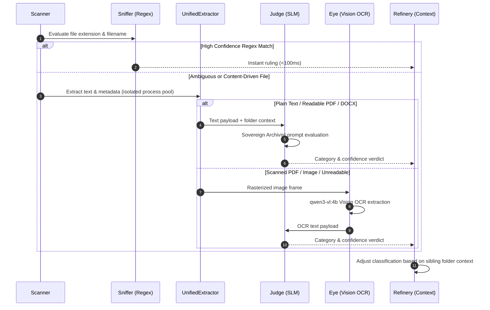

# FileFlow V10 — Technical System Map & Architectural Blueprint

---

## 1. System Overview & Mission

**FileFlow** is a 100% offline, AI-powered forensic document classification, staging, and archiving engine designed for high-integrity environments such as legal practices, administrative teams, and corporate compliance officers.

### Core Architectural Guarantees

1. **Zero Data Leakage:** All inference runs via local Ollama models on `localhost` (`127.0.0.1`). No document text, metadata, or metrics leave the local machine.
2. **Non-Destructive Execution:** Source files are never modified, moved, or cleaned up until an exact MD5 checksum match is verified at the destination path.
3. **Infinite Undo & Forensic Verification:** Every physical file move is recorded in a transactional audit ledger (`data/audit_ledger.json`) and exported to `Forensic_Manifest.json`. Any session can be fully rolled back byte-for-byte.
4. **Dry-Run & Preview Safety:** Operations are dry-run by default. Users can inspect in-memory proposals or explore a zero-copy hard-link tree (`ShadowMapper`) before approving physical disk writes.

---

## 2. High-Level Architecture

```mermaid
graph TD
    UI[Desktop Frontend - index.html / PyWebView] <--> API[FastAPI / PyWebView Bridge - app/api.py]
    CLI[Headless CLI - cli.py] --> API
    Main[Main Launcher - main.py] --> API

    subgraph Cognition Stack [app/brain/ - AI & Analysis Engine]
        Bridge[Bridge - bridge.py] <--> Ollama[(Ollama Local Models)]
        Sniffer[Sniffer - sniffer.py]
        Judge[Judge - judge.py]
        Eye[Eye OCR - eye.py]
        Extractor[Unified Extractor - extractor.py]
        Refinery[Refinery Context - refinery.py]
        Inspector[Inspector - inspector.py]
        TriagePool[Triage Pool - triage_pool.py]
    end

    subgraph Muscle Engine [app/muscle/ - File Operations & Staging]
        Scanner[DeepScanner - scanner.py]
        StagingMgr[StagingManager - manager.py]
        Unpacker[Entity Unpacker - unpacker.py]
        ShadowMapper[ShadowMapper Preview - shadow_mapper.py]
        StreamUnpacker[StreamUnpacker Async - stream_unpacker.py]
        AtomicExec[AtomicExecutor - executor.py]
        Ledger[TransactionLedger - transaction_ledger.py]
        Librarian[Librarian Naming - librarian.py]
        Versioning[Versioning Engine - versioning.py]
        Janitor[Janitor / Rollback - janitor.py]
    end

    subgraph Memory & State [app/memory/ - Storage & Search]
        Config[ConfigLoader - config.py]
        DB[(SQLite Session DB - data/fileflow.db)]
        LanceDB[(Vector Store - data/vectors.lance)]
        KnowledgeGraph[(Fact Graph DB - data/knowledge_graph.sqlite)]
    end

    API --> Scanner
    API --> Cognition Stack
    API --> Muscle Engine
    Cognition Stack --> Memory & State
    Muscle Engine --> Memory & State
```

---

## 3. The Four Execution Phases

### Phase 1: Forensic Discovery (`app/muscle/scanner.py`)

The `DeepScanner` executes a non-destructive recursive traversal of the target source directory:

- **Stack-Based Traversal:** Replaces recursive function calls with an explicit stack to eliminate stack-overflow errors on deeply nested directories.
- **Ghost & Corruption Detection:** Immediately identifies ghost files (<1KB empty documents) and unreadable binaries, flagging them for quarantine.
- **Cycle & Loop Safety:** Uses resolved canonical path tracking (`Path.resolve()`) to prevent endless loops caused by circular directory links.
- **Configurable Boundary Rules:** Enforces `max_depth` (default 10) and skips directory paths listed in `ignored_dirs` (`.venv`, `node_modules`, `FileFlow_Archive`).

### Phase 2: Cognition Staging (`app/brain/*`)

For each discovered file, FileFlow passes content through a tiered cognition pipeline:



- **Process-Isolated Extraction (`extractor.py`):** PDF text extraction runs in an isolated child process via `multiprocessing.Pool` with a strict 2-second timeout per file, isolating malformed PDF parser hangs.
- **Fast-Path Regex Triage (`sniffer.py`):** Instantly classifies deterministic files (e.g. tax documents, known bank formats) in under 100ms without invoking local LLMs.
- **Slow-Path AI Ruling (`judge.py`):** Uses `ministral-3:3b` via `bridge.py` to evaluate document text against the Sovereign Archivist taxonomy.
- **Vision Escalation (`eye.py`):** When extracted text is below readable thresholds, the document is rasterized and processed using Vision OCR (`qwen3-vl:4b`).
- **Context Refinery (`refinery.py`):** Analyzes parent directory names and sibling files to resolve grounding errors and prevent misclassification of isolated documents.

### Phase 3: Virtual Reconstruction (`app/muscle/manager.py` & `shadow_mapper.py`)

FileFlow models the proposed destination directory structure in memory before committing changes to disk:

- **In-Memory Plan (`manager.py`):** Builds a complete map of proposed file locations, entity groupings, and target file names.
- **Zero-Copy Hard-Link Preview (`shadow_mapper.py`):** Creates temporary NTFS/POSIX hard-link trees, allowing users to browse the exact post-organisation folder structure in Windows File Explorer without duplicating disk space.
- **Duplicate Identification:** Calculates MD5 hashes for exact byte-matching and uses LanceDB cosine similarity (`qwen3-embedding:4b`) to highlight semantic duplicates.

### Phase 4: Atomic Commitment & Infinite Undo (`app/muscle/executor.py` & `transaction_ledger.py`)

Upon explicit user approval in the UI or CLI:

1. **Pre-Move Hashing:** `TransactionLedger` computes and logs the source file's MD5 checksum.
2. **Metadata-Preserving Copy:** `AtomicExecutor` copies the file to the target path using `shutil.copy2` (preserving timestamps and attributes).
3. **Post-Move Hash Verification:** Computes the destination file's MD5 checksum. If `source_md5 != destination_md5`, the operation is aborted and flagged as corrupted.
4. **Transaction Commit:** Records the verified move in `data/audit_ledger.json` and updates `Forensic_Manifest.json`.
5. **Rollback Availability:** Running `python main.py --rollback <manifest>` reads `audit_ledger.json`, moves target files back to original paths, verifies hashes, and cleans empty directories.

---

## 4. Detailed Component Reference

### Cognition Stack (`app/brain/`)

| Module | Primary Class / Functions | Description & Responsibilities | Key Dependencies |
| :--- | :--- | :--- | :--- |
| [`bridge.py`](file:///c:/Users/sandi/Desktop/FileFlow/app/brain/bridge.py) | `Bridge` | Ollama HTTP API communication layer. Manages health checks, retries, model selection, and prompt formatting. | `requests`, `ollama` |
| [`judge.py`](file:///c:/Users/sandi/Desktop/FileFlow/app/brain/judge.py) | `Judge`, `Ruling` | Sovereign classification engine. Evaluates text payloads against prompt `config/prompts/ruling.md`. Validates output against `VALID_CATEGORIES`. | `bridge.py`, `extractor.py` |
| [`eye.py`](file:///c:/Users/sandi/Desktop/FileFlow/app/brain/eye.py) | `Eye` | Vision OCR handler. Uses `qwen3-vl:4b` to extract text from images (`.png`, `.jpg`) and scanned PDF page renders. | `fitz` (PyMuPDF), `Pillow` |
| [`inspector.py`](file:///c:/Users/sandi/Desktop/FileFlow/app/brain/inspector.py) | `Inspector` | Document summarisation and vector embedding generator. Generates embeddings via `qwen3-embedding:4b` for vector indexing. | `bridge.py`, `memory.py` |
| [`extractor.py`](file:///c:/Users/sandi/Desktop/FileFlow/app/brain/extractor.py) | `UnifiedExtractor` | Extractor facade for PDF, DOCX, TXT, and image files. Employs `multiprocessing.Pool` for child-process PDF isolation. | `pypdf`, `python-docx`, `fitz` |
| [`refinery.py`](file:///c:/Users/sandi/Desktop/FileFlow/app/brain/refinery.py) | `Refinery` | Context propagation engine. Sweeps sibling files in a directory to inherit category/entity metadata and correct grounding anomalies. | — |
| [`sniffer.py`](file:///c:/Users/sandi/Desktop/FileFlow/app/brain/sniffer.py) | `Sniffer` | High-speed regex/heuristic triage engine (<100ms). Bypasses local LLMs for deterministic filenames and patterns. | `re` |
| [`triage_pool.py`](file:///c:/Users/sandi/Desktop/FileFlow/app/brain/triage_pool.py) | `TriagePool` | V10 async tiered worker pool routing tasks through Sniffer → Judge → Eye based on confidence scores. | `asyncio` |
| [`discovery.py`](file:///c:/Users/sandi/Desktop/FileFlow/app/brain/discovery.py) | `Discovery` | Natural language semantic query interface over indexed documents in LanceDB. | `bridge.py`, `memory.py` |
| [`listener.py`](file:///c:/Users/sandi/Desktop/FileFlow/app/brain/listener.py) | `FolderListener` | Watchdog background service for always-on folder monitoring and real-time document ingestion. | `watchdog` |
| [`diagnostic.py`](file:///c:/Users/sandi/Desktop/FileFlow/app/brain/diagnostic.py) | `Diagnostic` | Generates pre-scan structural audits, size distribution charts, and complexity reports for targeted directories. | — |

### Muscle Engine (`app/muscle/`)

| Module | Primary Class / Functions | Description & Responsibilities | Key Dependencies |
| :--- | :--- | :--- | :--- |
| [`scanner.py`](file:///c:/Users/sandi/Desktop/FileFlow/app/muscle/scanner.py) | `DeepScanner` | Non-destructive recursive scanner with loop prevention, ghost file filtering, and configurable depth controls. | `pathlib` |
| [`manager.py`](file:///c:/Users/sandi/Desktop/FileFlow/app/muscle/manager.py) | `StagingManager` | In-memory proposal engine. Combines scanner outputs with cognition verdicts to build the staged movement plan. | `models.py` |
| [`unpacker.py`](file:///c:/Users/sandi/Desktop/FileFlow/app/muscle/unpacker.py) | `Unpacker` | Entity-based folder flattening and hierarchical archive reconstruction engine. | `extractor.py`, `judge.py` |
| [`executor.py`](file:///c:/Users/sandi/Desktop/FileFlow/app/muscle/executor.py) | `AtomicExecutor` | Physical file movement engine. Performs pre- and post-copy MD5 hashing and handles dry-run flags. | `transaction_ledger.py` |
| [`librarian.py`](file:///c:/Users/sandi/Desktop/FileFlow/app/muscle/librarian.py) | `Librarian` | AI-powered filename generator. Formats standardized names: `[Entity]_[Category]_[Date]_[Title].[ext]`. | `bridge.py` |
| [`versioning.py`](file:///c:/Users/sandi/Desktop/FileFlow/app/muscle/versioning.py) | `VersioningEngine` | Resolves target filename collisions using incrementing suffixes (`_v1`, `_v2`) and timestamp disambiguation. | — |
| [`shadow_mapper.py`](file:///c:/Users/sandi/Desktop/FileFlow/app/muscle/shadow_mapper.py) | `ShadowMapper` | V10 zero-copy hard-link preview generator. Constructs virtual directory trees without duplicating file bytes. | `os.link`, `os.symlink` |
| [`stream_unpacker.py`](file:///c:/Users/sandi/Desktop/FileFlow/app/muscle/stream_unpacker.py) | `StreamUnpacker` | V10 async generator streaming discovery engine. Pushes real-time file updates to the UI during scanning. | `asyncio` |
| [`transaction_ledger.py`](file:///c:/Users/sandi/Desktop/FileFlow/app/muscle/transaction_ledger.py) | `TransactionLedger` | Session transaction logger and 1-click rollback engine. Manages `audit_ledger.json`. | `json`, `hashlib` |
| [`janitor.py`](file:///c:/Users/sandi/Desktop/FileFlow/app/muscle/janitor.py) | `Janitor` | Staging area cleanup and session directory pruner. Contains hardcoded safety locks. | — |
| [`resource_monitor.py`](file:///c:/Users/sandi/Desktop/FileFlow/app/muscle/resource_monitor.py) | `ResourceMonitor` | System CPU and RAM throttle manager. Regulates worker thread counts to maintain UI responsiveness. | `psutil` |
| [`models.py`](file:///c:/Users/sandi/Desktop/FileFlow/app/muscle/models.py) | `StagedFile`, `ExecutionResult` | Core data structures and type definitions shared across staging, cognition, and execution modules. | `dataclasses` |

### Memory & Persistence Layer (`app/memory/`)

| Module | Primary Class / Functions | Description & Responsibilities | Storage File |
| :--- | :--- | :--- | :--- |
| [`config.py`](file:///c:/Users/sandi/Desktop/FileFlow/app/memory/config.py) | `ConfigLoader` | Loads, validates, and merges `settings.yaml` and `config.json` into unified configuration dataclasses. | `settings.yaml`, `config.json` |
| [`database.py`](file:///c:/Users/sandi/Desktop/FileFlow/app/memory/database.py) | `DatabaseManager` | Manages SQLite relational persistence for UI chat sessions, audit logs, and processed document metadata. | `data/fileflow.db` |
| [`memory.py`](file:///c:/Users/sandi/Desktop/FileFlow/app/memory/memory.py) | `Memory` | LanceDB vector database wrapper. Stores 1024-dim embeddings (`qwen3-embedding:4b`) for semantic similarity search. | `data/vectors.lance` |
| [`knowledge_graph.py`](file:///c:/Users/sandi/Desktop/FileFlow/app/memory/knowledge_graph.py) | `KnowledgeGraph` | Entity-relation graph. Links documents sharing case numbers, ID numbers, or reference keys. | `data/knowledge_graph.sqlite` |
| [`abbreviations.py`](file:///c:/Users/sandi/Desktop/FileFlow/app/memory/abbreviations.py) | `AbbreviationMap` | Normalizes entity and institutional names into canonical short codes for standardized folder structures. | — |

---

## 5. Storage Schemas & Data Structures

### SQLite Primary Database (`data/fileflow.db`)

- **`sessions`**: `session_id` (TEXT PRIMARY KEY), `timestamp` (DATETIME), `source_path` (TEXT), `status` (TEXT), `total_files` (INT), `moved_files` (INT).
- **`chat_history`**: `id` (INTEGER PRIMARY KEY), `session_id` (TEXT), `role` (TEXT), `message` (TEXT), `timestamp` (DATETIME).
- **`audit_logs`**: `log_id` (INTEGER PRIMARY KEY), `session_id` (TEXT), `action` (TEXT), `file_path` (TEXT), `status` (TEXT), `details` (TEXT).
- **`processed_files`**: `file_id` (TEXT PRIMARY KEY), `original_path` (TEXT), `target_path` (TEXT), `md5_hash` (TEXT), `category` (TEXT), `confidence` (FLOAT).

### Transaction Ledger Schema (`data/audit_ledger.json`)

```json
{
  "session_uuid_here": {
    "timestamp": "2026-08-09T07:25:00.000000",
    "status": "completed",
    "operations": [
      {
        "op_id": "op_uuid_here",
        "action": "move",
        "source_path": "C:\\Users\\User\\Downloads\\invoice.pdf",
        "source_md5": "e99a18c428cb38d5f260853678922e03",
        "destination_path": "C:\\Users\\User\\Desktop\\FileFlow_Archive\\Life_Admin\\Invoices\\2026_Invoice.pdf",
        "dest_md5": "e99a18c428cb38d5f260853678922e03",
        "status": "verified"
      }
    ]
  }
}
```

---

## 6. Security, Safety, & Stability Mechanisms

1. **Localhost Origin Isolation (CORS):** `main.py` explicitly locks `CORSMiddleware` to `allow_origins=["http://127.0.0.1:4173"]`. Browser tabs cannot query or trigger file execution endpoints on the local FastAPI server.
2. **PyInstaller Multiprocessing Freeze Guard:** `main.py` calls `multiprocessing.freeze_support()` as its first statement on Windows to prevent spawned worker child processes from recursively executing `main.py`.
3. **Hardcoded Code-Level Safety Locks:** File cleanup in `janitor.py` and directory deletion in `PruneExecutor` contain explicit `# SAFETY LOCK` markers and are disabled by default at the source code level.
4. **Approval Enforcement:** `api.py` filters proposed movements against the approved selection from the UI review screen and forcibly rejects low-confidence (`UNCERTAIN`, <0.7) files unless individually approved.
5. **SQL / Predicate Sanitization:** `memory.py` validates MD5 string hashes against `^[0-9a-f]{32}$` prior to interpolating into LanceDB query strings to prevent filter injection.

---

## 7. Performance Characteristics

*Tested on AMD Ryzen 5 5500U, 12GB RAM, NVMe SSD:*

| Pipeline Step | Processing Throughput | Resource Bottleneck |
| :--- | :--- | :--- |
| **Directory Scanning** | 200+ files / sec | Disk I/O (SSD bound) |
| **PDF Text Extraction** | 0.5 – 2.0s / file | CPU single-core (isolated pool) |
| **Fast-Path Triage (`Sniffer`)** | < 100ms / file | Regex evaluation |
| **SLM AI Ruling (`Judge`)** | ~6.0s / file | CPU LLM inference (`ministral-3:3b`) |
| **Vision OCR (`Eye`)** | 15.0 – 45.0s / file | RAM / VRAM allocation (`qwen3-vl:4b`) |
| **Vector Embedding (`Inspector`)** | ~0.5s / file | Ollama embedding speed |
| **MD5 Checksum Verification** | 0.1 – 0.5s / 10MB | SSD sequential read speed |

---

## 8. V10 Feature Integration & Roadmap

### Active & Verified V10 Infrastructure

- **`StreamUnpacker` (`stream_unpacker.py`):** Async generator streaming discovery that updates the UI in real-time as files are identified.
- **`ShadowMapper` (`shadow_mapper.py`):** NTFS/POSIX zero-copy hard-link preview engine wired to `api.py` (`execute_shadow_preview()`).
- **`Sniffer` (`sniffer.py`):** Sub-100ms regex triage engine bypassing LLM overhead for structured documents.
- **`TriagePool` (`triage_pool.py`):** Tiered worker pool routing files dynamically through Sniffer → Judge → Eye.
- **`KnowledgeGraph` (`knowledge_graph.py`):** SQLite fact graph linking documents by shared reference metadata.

### Architectural Roadmap (Future Releases)

- **Stories Engine:** Relational document grouping based on multi-entity shared metadata clusters rather than strict hierarchical folder categories.
- **Autonomous Trust Mode:** Single-click execution pipeline for trusted folders with background transaction logging and instant single-button rollback.
- **Agentic Tool-Calling Loop:** Full LLM agent loop exposing engine operations (`scanner`, `judge`, `executor`) as dynamic function tools within the PyWebView interface.