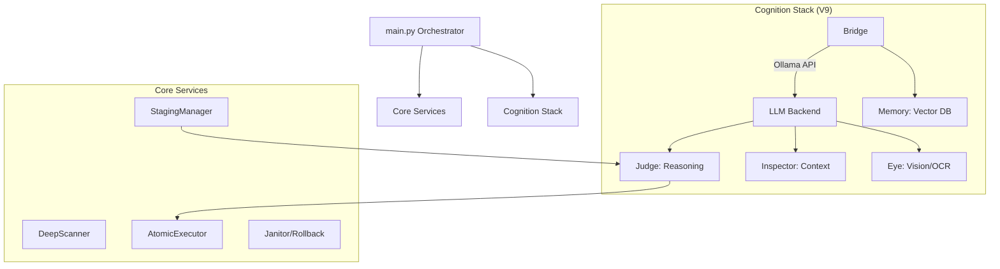

# FileFlow System Map — V9 Cognition Engine

## 🏗️ SYSTEM ARCHITECTURE (V9)



---

## 🧠 THE V9 COGNITION STACK

| Component | Responsibility | Model (Benchmark Winner) |
|---|---|---|
| **The Bridge** | Unified Ollama interface & reliability layer | `qwen2.5-coder:3b` |
| **The Judge** | Document classification & legal reasoning | `qwen2.5-coder:3b` |
| **The Eye** | Vision-based OCR & Image understanding | `llava-phi3:3.8b` |
| **The Memory** | Semantic storage & Vector search | `qwen3-embedding:4b` |
| **The Inspector** | Local grounding & Folder context resolution | `qwen2.5:3b` |

---

## 📂 DIRECTORY STRUCTURE

```
FileFlow/
├── main.py                          # 🎯 Entry point (orchestrator)
├── settings.yaml                    # ⚙️ PRIMARY config (AI models, paths)
├── config.json                      # 📋 SECONDARY config (Categories)
│
├── fileflow/
│   ├── core/                        # 🧠 Essential Logic
│   │   ├── config.py                # Loader: YAML/JSON merging
│   │   ├── scanner.py               # Forensic recursive scanner
│   │   └── logger.py                # Forensic audit logging
│   │
│   ├── intelligence/                # 🤖 The AI Brain (V9)
│   │   ├── bridge.py                # Ollama Reliability Bridge
│   │   ├── judge.py                 # Decision logic & Rulings
│   │   ├── inspector.py             # Context propagation logic
│   │   ├── eye.py                   # Vision & Image analysis
│   │   ├── memory.py                # Vector DB (LanceDB)
│   │   ├── extractor.py             # Text/PDF/Image data parsing
│   │   └── benchmark.py             # Performance testing suite
│   │
│   ├── staging/                     # 🎭 Virtual File Reconstruction
│   │   └── manager.py               # Semantic file clustering
│   │
│   ├── operations/                  # ⚡ Physical Actions
│   │   ├── executor.py              # Atomic file movements
│   │   ├── janitor.py               # Cleanup & Rollback
│   │   └── versioning.py            # AI-powered naming
│   │
│   └── ui/                          # 🎨 Presentation Layer
│       ├── dashboard.py             # Rich UI Reports
│       └── tui.py                   # Interactive TUI
│
├── fileflow_data/                   # 🗄️ System state
│   └── vectors.lance/               # Semantic Memory index
├── logs/                            # 📝 Forensic Audits
└── reports/                         # 📈 AI Benchmarks & Audit TXTs
```

---

## 🔄 V9 EXECUTION PIPELINE

### **Phase 1: Forensic Discovery**
The `DeepScanner` performs a bit-perfect scan of all source folders, generating hashes and identifying "ghost" or corrupted files before the AI touchs them.

### **Phase 2: Cognition Staging (AI-First)**
For every file:
1. **Extraction**: `UnifiedExtractor` pulls raw text/metadata.
2. **Vision (If Required)**: `Eye` processes images/scans if text is missing.
3. **Ruling**: `Judge` uses the **Sovereign Archivist** prompt to classify the file.
4. **Context**: `Inspector` looks at neighboring files to fix grounding errors.

### **Phase 3: Reconstruction (Dry-Run)**
The system builds a virtual archive in memory. It generates a `Forensic_Manifest.json` and a Rich Dashboard preview for user approval.

### **Phase 4: Atomic Commitment**
On execution:
1. Files are copied/moved to the destination.
2. Every move is MD5-verified for integrity.
3. If any step fails, the session is flagged for partial roll-back.

---

## 📊 PERFORMANCE STANDARDS (Ryzen 5 5500U)

| Operation | Performance | Bottleneck |
|---|---|---|
| **Scanning** | 200+ files/sec | SSD I/O |
| **Classification** | ~6s per file | CPU Inference |
| **Embedding** | ~0.5s per file | Token count |
| **Vision (OCR)** | ~15-45s per file | CPU VRAM |

---

## 🛡️ FORENSIC GUARANTEES

1. **Non-Destructive**: Original files are never touched until a bit-perfect copy is verified at the destination.
2. **100% Local**: No data leaves the machine. All "thinking" happens via Ollama.
3. **Audit Trail**: Every file has a MD5 signature tracked from source to destination.
4. **Full Rollback**: One command reverses any operation using the manifest.

---

**System Status**: ✅ COGNITION ONLINE (V9.2)
**Last System Update**: 2026-02-19

## 🏗️ SYSTEM OVERVIEW

```
┌─────────────────────────────────────────────────────────────────┐
│                     FileFlow V8 - Unified System                 │
│                   Forensic File Organization Engine              │
└─────────────────────────────────────────────────────────────────┘
                                 │
                    ┌────────────┴────────────┐
                    │      main.py            │
                    │   (Orchestrator)        │
                    └────────────┬────────────┘
                                 │
        ┌────────────────────────┼────────────────────────┐
        │                        │                        │
   ┌────▼─────┐          ┌──────▼──────┐         ┌──────▼──────┐
   │  CONFIG  │          │   SCANNER   │         │  EXTRACTOR  │
   │  SYSTEM  │          │   (Phase 1) │         │  (Phase 2)  │
   └────┬─────┘          └──────┬──────┘         └──────┬──────┘
        │                       │                        │
        │                       │                        │
        └───────────────────────┼────────────────────────┘
                                │
                        ┌───────▼────────┐
                        │    STAGING     │
                        │   MANAGER      │
                        │   (Phase 3)    │
                        └───────┬────────┘
                                │
                    ┌───────────┴───────────┐
                    │                       │
            ┌───────▼────────┐      ┌──────▼──────┐
            │   EXECUTOR     │      │   JANITOR   │
            │   (Phase 4)    │      │  (Cleanup)  │
            └───────┬────────┘      └──────┬──────┘
                    │                       │
                    └───────────┬───────────┘
                                │
                        ┌───────▼────────┐
                        │   MANIFEST     │
                        │  & ROLLBACK    │
                        └────────────────┘
```

---

## 📂 DIRECTORY STRUCTURE (Unified)

```
FileFlow/
├── main.py                          # 🎯 Entry point (orchestrator)
│
├── settings.yaml                    # ⚙️ PRIMARY config (paths, rules)
├── config.json                      # 📋 SECONDARY config (categories)
│
├── fileflow/                        # 📦 Core package
│   │
│   ├── core/                        # 🧠 Core systems
│   │   ├── __init__.py
│   │   ├── config.py                # ✅ UNIFIED config loader
│   │   ├── scanner.py               # 🔍 File discovery engine
│   │   ├── logger.py                # 📝 Logging system
│   │
│   ├── intelligence/                # 🤖 Smart extraction
│   │   ├── __init__.py
│   │   ├── extractor.py             # ✅ UNIFIED extractor
│   │   ├── abbreviations.py         # 📏 Name shortening
│   │   └── diagnostic.py            # 🩺 Forensic auditing
│   │
│   ├── staging/                     # 🎭 Pre-execution phase
│   │   ├── __init__.py
│   │   └── manager.py               # ✅ FIXED staging (ProcessPool)
│   │
│   ├── operations/                  # ⚡ File operations
│   │   ├── __init__.py
│   │   ├── executor.py              # 📦 Atomic file mover
│   │   ├── janitor.py               # 🧹 Cleanup & rollback
│   │   └── versioning.py            # 🔢 Filename generation
│   │
│   └── ui/                          # 🎨 User interfaces
│       ├── __init__.py
│       ├── dashboard.py             # 📊 Rich console UI
│       ├── tui.py                   # 💻 Textual TUI (optional)
│       └── cli.py                   # ⌨️  Command-line parser
│
├── logs/                            # 📋 Session & audit logs
│   ├── session_YYYYMMDD_HHMMSS.log
│   ├── migration_audit.csv
│   └── system_forensics.log
│
└── reports/                         # 📈 Diagnostic reports
    └── discovery_audit_YYYYMMDD.txt
```

---

## 🔄 EXECUTION FLOW (Step-by-Step)

### **Phase 1: Deep Scan**
```
User Input → Scanner → File Discovery
          ↓
    [Respects ignore rules]
          ↓
    [Max depth: 10 levels]
          ↓
    [Extensions: .pdf, .docx, .doc]
          ↓
    Output: List[Path] (all files)
```

### **Phase 2: Deep Analysis & Staging**
```
For each file:
    1. Ghost File Check
       ├─ Size < 1KB? → Quarantine as "Ghost_File"
       └─ Valid size → Continue
    
    2. Content Hash Calculation
       ├─ PDF? → ProcessPoolExecutor (3s timeout)
       │   ├─ Header valid? → Extract text
       │   ├─ Timeout? → MD5 fallback + Quarantine
       │   └─ Success? → MD5 of normalized text
       └─ Other? → MD5 of binary content
    
    3. Metadata Extraction
       ├─ Filename patterns (job_packet, firm_app)
       ├─ PDF content (Z83 forms, references)
       └─ SubType classification (CV, Certificate, etc.)
    
    4. Entity Resolution
       ├─ Reference number → REF_XXXXX
       ├─ Position name → JUDGES_SECRETARY
       └─ Fallback → "Unclassified"
    
    5. Staging
       └─ Add to staged_files[entity]
```

### **Phase 3: Folder Context Resolution**
```
Group files by parent directory
    ↓
Find "Anchor Files" (Z83 with strong metadata)
    ↓
Propagate entity to siblings in same folder
    ↓
Result: Better classification for generic files
```

### **Phase 4: Execution**
```
For each entity:
    For each subtype:
        Sort files chronologically
        ↓
        For each file:
            Generate versioned filename
            ↓
            Copy to destination (with MD5 verify)
            ↓
            Log to manifest + audit CSV
```

### **Phase 5: Cleanup (Optional)**
```
User confirmation
    ↓
Delete source files (per manifest)
    ↓
Remove empty folders
    ↓
Log space reclaimed
```

---

## 🔧 CRITICAL FIXES APPLIED

### **Fix #1: ProcessPoolExecutor (Eliminating Hangs)**
**Problem**: ThreadPoolExecutor can't terminate frozen threads
**Solution**: Switched to ProcessPoolExecutor - processes can be killed

**Location**: `fileflow/staging/manager.py`

**Before**:
```python
with concurrent.futures.ThreadPoolExecutor(max_workers=1) as executor:
    # Thread hangs forever on corrupted PDF
```

**After**:
```python
with concurrent.futures.ProcessPoolExecutor(max_workers=1) as executor:
    # Process terminates after 3s timeout
```

**Key Changes**:
- Created `worker_extract_pdf_text()` as top-level function
- Processes have isolated memory (no shared state issues)
- Timeout triggers process termination, not graceful shutdown

---

### **Fix #2: Ghost File Detection**
**Problem**: Tiny/empty files (0-1KB) cause extraction failures
**Solution**: Pre-screen files before processing

**Location**: `fileflow/staging/manager.py` → `stage_file()`

```python
file_size = os.path.getsize(file_path)
if file_size < 1024:  # Ghost file threshold
    # Skip processing, quarantine immediately
    staged = StagedFile(
        metadata={'entity': 'Ghost_Files', 'needs_quarantine': True}
    )
```

**Result**: Instant skip, no CPU wasted

---

### **Fix #3: Unified Extractor**
**Problem**: Two extractors with duplicate logic
**Solution**: Merged into single `UnifiedExtractor`

**Removed**: 
- `text_extractor.py` (old)

**Kept**:
- `extractor.py` (enhanced with all features)

**Benefits**:
- Single source of truth
- Consistent behavior
- Easier maintenance

---

### **Fix #4: Unified Config System**
**Problem**: 3 config sources (YAML, JSON, hardcoded)
**Solution**: Single `ConfigLoader` that merges all

**Load Priority**:
1. `settings.yaml` (primary settings)
2. `config.json` (category rules)
3. Hardcoded fallbacks (backwards compat)

**Benefits**:
- One place to change settings
- Graceful degradation if files missing
- Export merged config for portability

---

## 🚀 DEPLOYMENT INSTRUCTIONS

### **Step 1: Backup Current System**
```bash
cd C:\Users\sandi\Desktop\FileFlow
mkdir BACKUP_V8_OLD
xcopy /E /I fileflow BACKUP_V8_OLD\fileflow
copy main.py BACKUP_V8_OLD\
```

### **Step 2: Replace Fixed Files**
Replace these 3 files with the fixed versions:

1. **`fileflow/staging/manager.py`**
   - Replace with: `manager_fixed.py`
   
2. **`fileflow/intelligence/extractor.py`**
   - Replace with: `extractor_unified.py`
   
3. **`fileflow/core/config.py`**
   - Replace with: `config_unified.py`

### **Step 3: Delete Obsolete Files**
```bash
# Remove duplicate extractor
del fileflow\intelligence\text_extractor.py

# Remove old config files (optional - keep as reference)
move fileflow\core\config_old.py BACKUP_V8_OLD\
```

### **Step 4: Verify Dependencies**
```bash
pip install --upgrade pypdf PyYAML rich textual
```

### **Step 5: Test Run (Dry Run)**
```bash
python main.py "C:\Users\sandi\Desktop\INTERNSHIP_DEMO_SOURCE" ^
    --dest "C:\Users\sandi\Desktop\Professional_Archive_2026" ^
    --dry-run
```

**Expected Output**:
```
✅ No hangs on corrupted PDFs
✅ [GHOST] messages for tiny files
✅ [TIMEOUT] messages for stuck PDFs (< 3 seconds)
✅ Completes without KeyboardInterrupt
```

### **Step 6: Run for Real**
```bash
python main.py "C:\Users\sandi\Desktop\INTERNSHIP_DEMO_SOURCE" ^
    --dest "C:\Users\sandi\Desktop\Professional_Archive_2026" ^
    --execute
```

---

## 📊 PERFORMANCE METRICS (Your Hardware)

**Ryzen 5 5500U (6 cores, 12 threads) + 12GB RAM**

| Task | Expected Speed | Notes |
|------|----------------|-------|
| File scanning (1000 files) | ~5-10 seconds | Disk I/O bound |
| PDF text extraction | 0.5-2s per file | Depends on page count |
| MD5 hashing | 0.1-0.5s per MB | Fast on SSD |
| Timeout recovery | 3s max per file | Hard limit enforced |
| Ghost file skip | < 1ms | Instant |

**Total for 808 files**:
- Without fix: 10-30 minutes (hangs on corrupted PDFs)
- With fix: 3-8 minutes (skips/timeouts gracefully)

---

## 🛡️ SAFETY FEATURES

1. **Dry-Run by Default**: Never moves files unless `--execute` flag
2. **MD5 Verification**: Every copy is verified before source deletion
3. **Forensic Manifest**: Complete rollback capability
4. **Quarantine Folder**: Corrupted files isolated, not deleted
5. **Audit Logging**: CSV log of every operation
6. **Source Preservation**: Original files only deleted after verified copy

---

## 🔍 TROUBLESHOOTING

### Problem: Still hanging?
**Check**: Are you using the **fixed** `manager.py`?
- Should say `ProcessPoolExecutor`, not `ThreadPoolExecutor`
- Should have `worker_extract_pdf_text()` at top-level

### Problem: Import errors?
**Solution**: Verify package structure
```bash
cd C:\Users\sandi\Desktop\FileFlow
python -c "from fileflow.staging.manager import StagingManager; print('OK')"
```

### Problem: Config not loading?
**Solution**: Check file paths
```bash
python -c "from fileflow.core.config import ConfigLoader; c=ConfigLoader(); print(c.system.version)"
```
Should print: `8.0.0`

### Problem: No files being processed?
**Solution**: Check ignore rules in `settings.yaml`
- Ensure your source folder isn't in `ignored_dirs`

---

## 📈 FUTURE ENHANCEMENTS (Optional)

### 1. Ollama Integration (Smart Classification)
```python
# Add to extractor.py
def classify_with_llm(self, text: str) -> str:
    response = requests.post('http://localhost:11434/api/generate',
        json={'model': 'qwen2.5:0.5b', 'prompt': f'Classify: {text[:500]}'})
    return response.json()['response']
```

### 2. Parallel Processing (Faster Scanning)
```python
# Add to main.py
with ProcessPoolExecutor(max_workers=4) as executor:
    futures = [executor.submit(staging.stage_file, f) for f in file_list]
    for future in as_completed(futures):
        result = future.result()
```

### 3. Web Dashboard (Better UX)
```python
# Create fileflow/ui/web_dashboard.py
from flask import Flask, render_template
app = Flask(__name__)
@app.route('/')
def dashboard():
    return render_template('dashboard.html', stats=get_stats())
```

---

## 📞 SUPPORT & MAINTENANCE

**Log Locations**:
- Session logs: `logs/session_*.log`
- Audit trail: `logs/migration_audit.csv`
- Forensic log: `logs/system_forensics.log`

**Manifest Location**:
- `<destination>/Forensic_Manifest.json`

**Rollback Command**:
```bash
python main.py --rollback "C:\path\to\Forensic_Manifest.json"
```

**Diagnostic Mode**:
```bash
python main.py "C:\source" --audit
# Generates report without moving files
```

---

## ✅ VERIFICATION CHECKLIST

- [ ] Backed up old system
- [ ] Replaced `manager.py` with fixed version
- [ ] Replaced `extractor.py` with unified version
- [ ] Replaced `config.py` with unified version
- [ ] Deleted `text_extractor.py`
- [ ] Tested dry-run (no hangs)
- [ ] Verified timeout messages appear
- [ ] Checked manifest generation
- [ ] Confirmed audit CSV created
- [ ] Tested rollback command

---

**System Status**: ✅ READY FOR PRODUCTION

**Emergency Contact**: This documentation

**Last Updated**: 2026-02-15

**Version**: 8.0.0-UNIFIED-FIX
