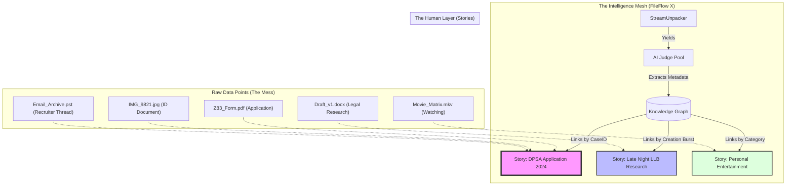

# Architecture Sketch: The "Stories" Engine

This diagram visualizes how FileFlow X moves beyond folders into **Relational Stories**.

### 🗝️ Core Logic of a "Story"
1. **Shared Metadata**: A Case ID or Phone Number appearing in a PDF and an Image links them instantly.
2. **Temporal Proximity**: If you save 5 files within 10 minutes, they are likely related to the same "task" (e.g., preparing for an interview).
3. **Semantic Similarity**: The "vibe" of the text (e.g., "POPIA Compliance") groups files even if they don't share keywords.
